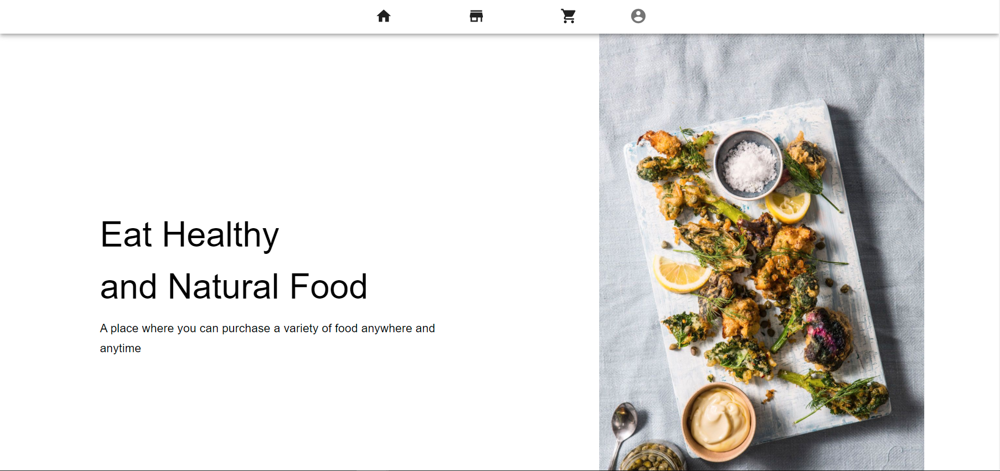
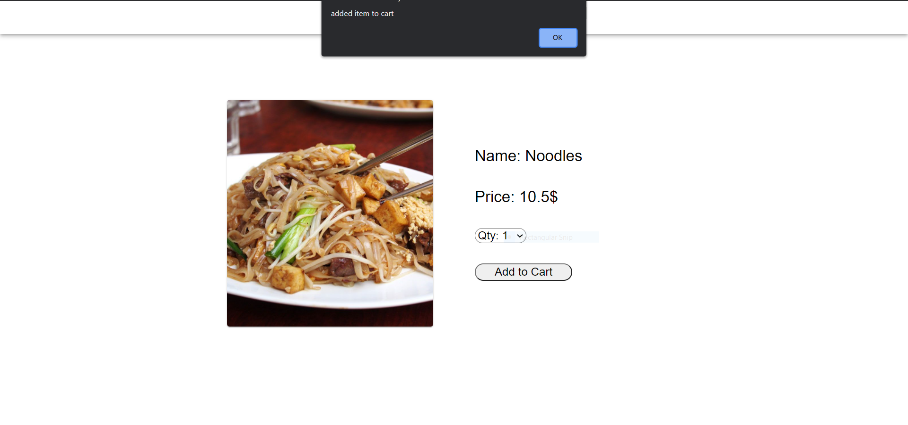
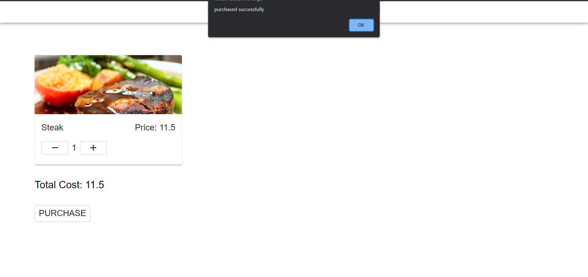

# Shop-App
Crud Application using MongoDB, Material UI, Reactjs, Expressjs

Not the best looking project, but it was my first MERN app for a shopping cart where I learned to use backend and frontend.

Things I leanred: 
1. Material Ui
2. JWT token 
3. Creating a login page and sign up page  
4. Storing username and password into window.localStorage
5. React router 

Things to add in the future
1. User editing items in the Menu

